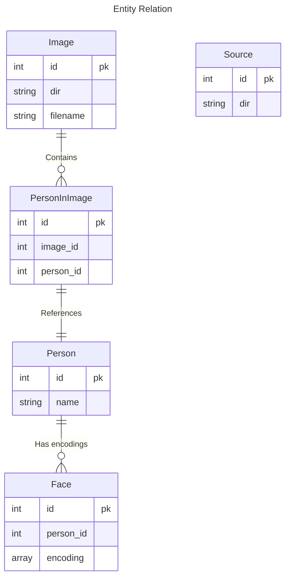

# Database Relation Documentation

```mermaid
---
title: Entity Relation
---
erDiagram
    Image {
        int id pk
        string dir
        string filename
    }
    
    Person {
        int id pk
        string name
    }
    
    Face {
        int id pk
        int person_id
        array encoding
    }  
    
    PersonInImage {
        int id pk
        int image_id
        int person_id
    }
    
    Source { 
        int id pk
        string dir
    }  
    
    
    Image ||--o{ PersonInImage : "Contains"
    PersonInImage ||--|| Person : "References"
    Person ||--o{ Face : "Has encodings"
```

The SQLite3 implementation implements an additional adapter to handle arrays to simplify the storage of vectors (embeddings) of faces.